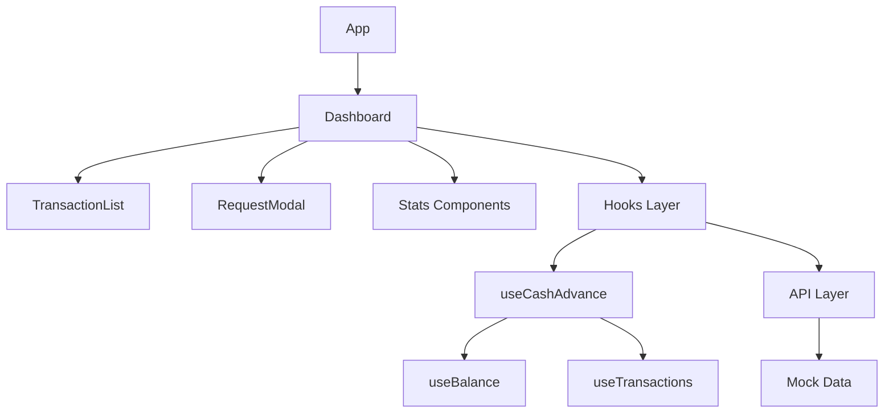

# Cash Advance Dashboard

A modern, responsive cash advance management system built with React, TypeScript, and Styled Components.

## 🏗 Architecture



## 📁 Project Structure

```
src/
├── api/               # API interfaces and endpoints
├── components/        # React components
│   ├── atoms/        # Basic building blocks
│   ├── molecules/    # Combinations of atoms
│   └── organisms/    # Complex components
├── hooks/            # Custom React hooks
├── types/            # TypeScript definitions
├── utils/            # Helper functions
└── theme.ts          # Global styling theme
```

## 🎯 Design Principles

1. **Atomic Design**
   - Components are organized using atomic design principles
   - Promotes reusability and maintainability

2. **Clean Architecture**
   - Clear separation of concerns
   - Business logic isolated in hooks
   - UI components remain pure and presentational

3. **Type Safety**
   - Comprehensive TypeScript usage
   - Strict type checking enabled

4. **Component Composition**
   - Favors composition over inheritance
   - Small, focused components
   - Clear component boundaries

5. **State Management**
   - Custom hooks for business logic
   - Local state for UI concerns
   - Centralized data flow

## 🚀 Getting Started

1. Install dependencies:
   ```bash
   npm install
   ```

2. Start development server:
   ```bash
   npm run dev
   ```

3. Run tests:
   ```bash
   npm test
   ```

4. Build for production:
   ```bash
   npm run build
   ```

## 🔧 Development Tools

- **Code Quality**
  - ESLint for linting
  - Prettier for formatting
  - Husky for git hooks
  - Vitest for testing

- **Git Hooks**
  - Pre-commit: Type checking and formatting
  - Pre-push: Tests and build

## 📦 Deployment

### Netlify Deployment

1. Connect your repository to Netlify
2. Configure build settings:
   - Build command: `npm run build`
   - Publish directory: `dist`
3. Deploy!

### AWS Deployment (S3 + CloudFront)

1. Create S3 bucket
2. Configure for static website hosting
3. Create CloudFront distribution
4. Deploy using AWS CLI:
   ```bash
   aws s3 sync dist/ s3://your-bucket-name
   ```

## 🎨 Styling

- Styled Components for component-specific styling
- Global theme for consistency
- Responsive design patterns
- Framer Motion for animations

## 🔒 Security

- Type-safe API calls
- Environment variable management
- XSS prevention through React
- CORS configuration

## 📈 Performance

- Code splitting
- Lazy loading
- Optimized bundle size
- Efficient re-renders

## 🤝 Contributing

1. Fork the repository
2. Create feature branch
3. Commit changes
4. Push to branch
5. Create Pull Request

## 📝 License

MIT